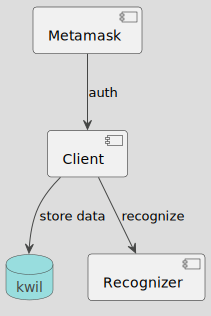

## AI Photo Challenge
Simple AI Game with decentralised data store on Kwil. Created for  ETHShanghai 2023 

## Main user flow 

## Technical stack and Archtecture 

The architecture of the application is depicted in the image below:

Where:

- Client is vue UI, whitch uses for upload photo, iterates with recognizer backend for get faces vectors. This vectors will stored in KWil decentralised database using Kwill JS SDK 
- Metamask uses for authorisation and sign KWill transactions 
- Recognizer backend - Golang application that uses dLib SDK for face recognition issues. There is main two methods - get face vectors from photos for create challenge and compare vectors in Euclidean space. 

